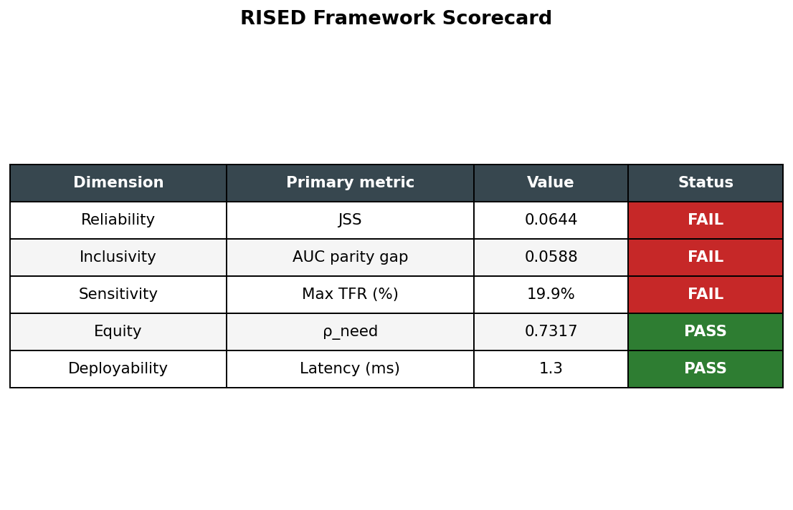
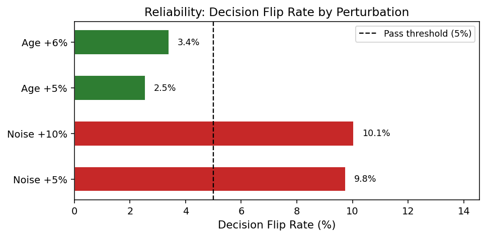
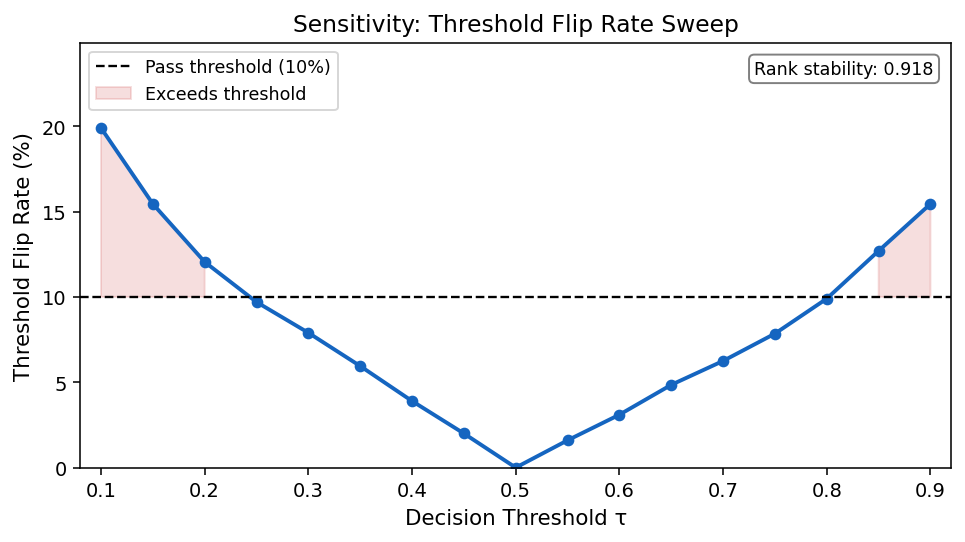

# RISED Framework

**A measurement toolkit for evaluating high-stakes AI decision-support
systems across five dimensions — Reliability, Inclusivity, Sensitivity,
Equity, Deployability — computing each metric with bootstrap confidence
intervals, plus a configurable advisory policy layer on top. Applied to
healthcare, with cross-domain demonstrations on credit and hiring expert
systems.**

[](https://huggingface.co/datasets/Rohithreddybc/rised-healthcare-eval-dataset)
[](https://doi.org/10.57967/hf/8734)
[](LICENSE)
[](pyproject.toml)
[](#tests)
[](#tests)

> An XGBoost classifier with **AUROC 0.961** can still fail three of five
> RISED metrics. Aggregate accuracy alone does not surface reliability under
> input perturbation, subgroup performance gaps, threshold instability, or
> proxy-dependent equity findings.

RISED — **R**eliability, **I**nclusivity, **S**ensitivity, **E**quity,
**D**eployability — is a measurement toolkit for high-stakes AI
decision-support systems. Each of the five dimensions is operationalized
as a metric computed with bootstrap 95% confidence intervals, packaged as an
open-source Python library.

The library is explicitly two-layered. The **measurement layer**
(`rised.evaluate_all` and the `evaluate_*` functions) returns metrics and
intervals and contains no thresholds. The **policy layer** (`rised.policy`)
applies thresholds *you supply* and returns advisory verdicts. RISED ships no
default cut-points, does not certify that a model is safe or cleared to deploy,
and returns `INDETERMINATE` rather than a positive verdict whenever a dimension
is missing, unconfigured, or its confidence interval straddles your threshold.
The former `report.all_passed()` gate was withdrawn in 0.2.0 and now raises.
The framework was
developed for clinical AI (where the empirical evidence is densest and the
regulatory discussion is most active) and is demonstrated on
credit-scoring and hiring expert systems via the cross-domain demos in
`examples/`.

📄 **Paper:** *RISED: A Pre-Deployment Evaluation Framework for High-Stakes
AI Decision-Support Systems, with Application to Healthcare* — manuscript
in preparation for submission to the *Journal of Biomedical Informatics*
(Elsevier).
Dataset DOI: [10.57967/hf/8734](https://doi.org/10.57967/hf/8734)

---

## How to Cite

If you use RISED in your own evaluation, please cite the paper:

```bibtex
@unpublished{bellibatlu2026rised,
  title   = {RISED: A Pre-Deployment Evaluation Framework for
             High-Stakes AI Decision-Support Systems, with
             Application to Healthcare},
  author  = {Bellibatlu, Rohith Reddy and Singh, Manpreet and
             Jajoo, Yash and Lakhanpal, Shyamal and Israni, Abhishek},
  note    = {Manuscript in preparation for submission to the
             Journal of Biomedical Informatics},
  year    = {2026},
  url     = {https://github.com/rohithreddybc/rised-healthcare-eval}
}
```

## One-command reproduction

```bash
git clone https://github.com/rohithreddybc/rised-healthcare-eval.git
cd rised-healthcare-eval
conda env create -f environment.yml && conda activate rised
python -m rised.reproduce_all
```

This runs, in sequence: four real-data within-cohort evaluations (UCI Heart
Disease, UCI Diabetes 130, NHIS 2024, NHIS 2023), the multi-model
robustness check, the Fairlearn comparison, and three cross-domain demos
(`adult_income_demo.py`, `folktables_acs_income_demo.py`,
`german_credit_demo.py`). It does **not** currently run the synthetic-cohort
baseline or the NHANES 2021–2023, BRFSS 2024, or MIMIC-IV-ED evaluations —
run those individually with the corresponding script listed in the cohort
table below.

---

## Why RISED

Standard model evaluation reports a single number (AUROC, Brier score,
accuracy) on a held-out test set. That number cannot detect:

- A model that flips one in fifteen patient classifications under semantically
  equivalent input encodings (**Reliability**).
- An AUC parity gap concentrated in the oldest patient subgroup
  (**Inclusivity**).
- Unstable threshold behavior that reclassifies ~20% of patients when the
  binary cutoff is adjusted to balance sensitivity vs. specificity (**Sensitivity**).
- Scoring decisions whose alignment with clinical need depends on the
  proxy chosen, with the verdict flipping under an independent need proxy
  (**Equity**).
- Models whose explanations contradict each other patient to patient or fail
  per-patient latency targets (**Deployability**).

These failure modes are well-documented at scale in production clinical AI
(Obermeyer et al., *Science* 2019; Wong et al., *JAMA Intern Med* 2021;
Finlayson et al., *NEJM* 2021), but no existing toolkit reports all five as
part of a single, reproducible measurement pass.

---

## The Five Dimensions

| Dimension | Primary measurement | Illustrative threshold (you supply) | Basis |
|-----------|---------------------|-------------------------------------|-------|
| **R**eliability   | Judge Sensitivity Score (JSS), and the **minimum** per-perturbation rank correlation | JSS < 0.05; min ρ ≥ 0.95 | Steyerberg 2010; JudgeSense 2025 |
| **I**nclusivity   | Maximum **per-partition** AUC parity gap Δ_AUC | ≤ 0.05 | FDA AI/ML Action Plan 2021; AIF360 |
| **S**ensitivity   | Max threshold flip rate (TFR) over the **narrow [0.30, 0.70] band** | ≤ 10%  | Wynants 2019 |
| **E**quity        | Need-prediction ρ (Spearman) against an **independent** proxy, reported against its attainable ceiling | *no threshold* — diagnostic only | Cohen 1988; Obermeyer 2019 |
| **D**eployability | Single-row latency; batch scoring time | ≤ 500 ms | Sutton 2020 |

> **These are illustrative, not defaults.** `PolicyThresholds` fields default to
> `None`; a dimension with no threshold configured is `NOT_CONFIGURED` and makes
> the roll-up `INDETERMINATE`. None of these cut-points has been calibrated
> against observed deployment outcomes.
>
> Equity carries no threshold at all. With a binary need proxy of prevalence
> `p`, ρ is provably `√(12p(1−p))·(n/√(n²−1))·(AUC−0.5)` and is bounded by
> `√(3p(1−p))`, so a fixed 0.70 target is **unattainable at any model quality**
> outside `p ∈ [0.2056, 0.7944]`. The library reports the cohort's ceiling
> instead, and **raises** if the supplied proxy is derived from `y_true`.

---

## Quickstart

```bash
git clone https://github.com/rohithreddybc/rised-healthcare-eval.git
cd rised-healthcare-eval
pip install -e .
```

```python
import rised
from rised.datasets import load_synthea_cohort, train_baseline_model
from sklearn.model_selection import train_test_split

# 1. Load data + train any sklearn-compatible classifier with predict_proba
X, y, demo = load_synthea_cohort()
X_tr, X_te, y_tr, y_te, d_tr, d_te = train_test_split(
    X, y, demo, test_size=0.20, random_state=42, stratify=y)
model = train_baseline_model(X_tr, y_tr)

# 2. Define perturbations for the Reliability dimension.
#    Binary and categorical columns never receive continuous noise: the column
#    types are inferred, or pass your own rised.perturbations.FeatureSchema.
#    unit_rescaling is classified as covariate shift, not reliability, unless
#    the factor is a documented unit conversion — so the two entries below are
#    reported separately and excluded from JSS.
specs = [
    {"type": "gaussian_noise", "scale": 0.05, "random_state": 0, "label": "noise_5pct"},
    {"type": "gaussian_noise", "scale": 0.10, "random_state": 1, "label": "noise_10pct"},
    {"type": "unit_rescaling", "feature_index": 0, "factor": 1.05, "label": "age_+5pct"},
    {"type": "unit_rescaling", "feature_index": 0, "factor": 1.06, "label": "age_+6pct"},
]

# 3. MEASUREMENT LAYER: run all five dimensions with bootstrap CIs.
#    need_column is required for Equity; omit it and Equity is skipped with a
#    recorded reason rather than silently falling back to y_true.
#    Pass groups=<patient ids> when rows are repeated encounters.
report = rised.evaluate_all(
    model, X_te, y_te, d_te,
    perturbation_specs=specs,
    tau_ref=0.5,             # see rised.sensitivity.suggest_tau_ref
    random_state=42, n_bootstrap=1000,
)

print(report.measurement_summary())
print(f"JSS = {report.reliability.judge_sensitivity_score:.4f} "
      f"95% CI {report.reliability.jss_ci}")
# Expected output (random_state=42, B=1000):
# JSS = 0.0108 95% CI (0.0074, 0.0145)

# 4. POLICY LAYER: your thresholds, advisory verdicts.
from rised.policy import PolicyThresholds, evaluate_policy

policy = evaluate_policy(report, PolicyThresholds(
    max_judge_sensitivity_score=0.05,
    min_rank_correlation=0.95,        # applied to the MINIMUM, not the mean
    max_partition_auc_gap=0.05,
    max_subgroup_ece=0.10,
    max_threshold_flip_rate=0.10,
    max_single_row_latency_ms=500.0,
))
print(policy.verdict_table())
print(policy.explain())   # includes the advisory notice and every criterion
```

A scorecard visualization is one call away:

```python
from rised.visualization import plot_framework_dashboard
fig = plot_framework_dashboard(report, thresholds)  # thresholds optional
fig.savefig("scorecard.png", dpi=150)
```



---

## Reproducing the Paper's Results

The paper applies RISED's metric and bootstrap-CI functions to an XGBoost
classifier (AUROC 0.961, Brier 0.073) on the 2,000-patient held-out test
split. The table below reports BCa bootstrap confidence intervals computed
from the library's estimator functions. The Status column is an **advisory**
verdict under the illustrative thresholds above, using the CI rule (a metric
whose CI excludes the threshold is MEETS / DOES NOT MEET; one whose CI spans it
is INDETERMINATE). It is not a deployment determination.

> **Several of these numbers changed in 0.2.0, and the changes are not
> cosmetic.** Both columns are shown so the difference is auditable.

| Measurement | 0.1.0 value | 0.2.0 value | 95% BCa CI (0.2.0) | Advisory status |
|-------------|------------:|------------:|:------------------:|:---------------:|
| JSS (semantics-preserving only) | 0.064 | **0.011** | [0.007, 0.014] | MEETS |
| Δ_AUC (max per-partition)       | 0.059 | **0.046** | [0.030, 0.056] | INDETERMINATE¹ |
| Δ_AUC (pooled, diagnostic only) | 0.059 | 0.059 | — | — |
| Max TFR (narrow band 0.30–0.70) | 19.9% | **7.9%** | [6.8%, 9.1%] | INDETERMINATE² |
| Max TFR (wide band 0.10–0.90)   | 19.9% | 19.9% | — | secondary |
| ρ_need (outcome proxy)          | 0.732 | **withdrawn**³ | — | — |
| ρ_need (CCI proxy)              | 0.599 | 0.599 | — | DIAGNOSTIC |
| Batch scoring time (10k rows)   | ~1 ms | 1.15 ms | — | — |
| Single-row latency              | *not measured* | **0.38 ms** | — | MEETS |

¹ CI [0.030, 0.056] spans 0.05.
² CI [6.8%, 9.1%] lies below 10%; reported INDETERMINATE only if your threshold
  falls inside it.
³ Withdrawn under F8: with a binary outcome proxy the statistic is an affine
  reparameterisation of AUROC and carries no independent information.

**What changed and why.** The JSS drop from 0.064 to 0.011 is entirely due to
reclassifying `age × 1.05` and `age × 1.06` as covariate shift: multiplying age
by 5% produces a different patient, not a different encoding of the same
patient. Those two perturbations, not the Gaussian noise, were driving the
former Reliability failure — the earlier claim that the failure was "dominated
by Gaussian noise perturbations" was wrong. The Δ_AUC drop reflects computing
the range within each demographic column rather than pooling every level of
every column. The Max TFR drop reflects reporting the narrow band as primary;
the wide-band figure is unchanged and still reported. One subgroup
(`age_group=18-44`, 1 positive of 371) is now explicitly listed in
`excluded_subgroups` instead of being silently skipped.

Bootstrap CIs from 1,000 iterations with `random_state=42`. Hardware-dependent
timings reported on a single test machine.

Per-perturbation flip rates (semantics-preserving set):



Threshold flip rate across the sweep. The peaks sit at τ = 0.10 and τ ≥ 0.80 —
i.e. **outside** the narrow [0.30, 0.70] band that 0.2.0 reports as primary, so
the headline Max TFR falls from 19.9% to 7.9%. Read TFR alongside a
discrimination metric: it is a functional of the score CDF alone and never
reads `y_true`, so a constant predictor attains a perfect TFR of 0.



---

## Dataset

The 10,000-patient synthetic cohort is published as a HuggingFace dataset:

🤗 **[Rohithreddybc/rised-healthcare-eval-dataset](https://huggingface.co/datasets/Rohithreddybc/rised-healthcare-eval-dataset)**

```python
from datasets import load_dataset
ds = load_dataset("Rohithreddybc/rised-healthcare-eval-dataset")
df = ds["train"].to_pandas()  # (10000, 26)
```

Or regenerate deterministically from source:

```python
from rised.datasets import generate_synthea_cohort
df = generate_synthea_cohort(n=10000, random_state=42)
```

The cohort is fully synthetic (Synthea-inspired), Medicare/Medicaid-weighted,
with 30% high-need prevalence. **No real patient records were used at any
stage.** See the [HuggingFace dataset card](https://huggingface.co/datasets/Rohithreddybc/rised-healthcare-eval-dataset)
for the full feature schema and demographic breakdown.

---

## How RISED Compares

RISED is designed to **complement** existing toolkits, not replace them:

| Toolkit | Purpose | Output |
|---------|---------|--------|
| AI Fairness 360 | Menu of fairness metrics for model selection | Metrics (development-time) |
| Fairlearn       | Fairness-aware training algorithms           | Metrics + mitigation (development-time) |
| TRIPOD+AI       | Reporting standard for prediction studies   | Reporting checklist only |
| TEHAI           | Translational evaluation taxonomy            | Qualitative taxonomy |
| **RISED**       | **5-dimension metric suite with bootstrap CIs and a configurable advisory policy layer** | **Metrics + advisory pass/fail flags** |

RISED's five dimensions were chosen to reflect testing concerns raised — but
not specified in operational detail — by the FDA AI/ML Action Plan, the ONC
HTI-1 rule, and the EU AI Act. RISED does not implement, and does not claim,
compliance with any of these frameworks.

---

## Tests

```bash
pytest --tb=short -q
```

168 tests passing, 91% overall line coverage. Per-module coverage is 81–100%
across the evaluation modules; `reproduce_all` is the one uncovered module, as
it orchestrates network-dependent example scripts.

---

## Citation

```bibtex
@unpublished{bellibatlu2026rised,
  title   = {{RISED}: A Pre-Deployment Evaluation Framework for High-Stakes {AI}
             Decision-Support Systems, with Application to Healthcare},
  author  = {Bellibatlu, Rohith Reddy and Singh, Manpreet and
             Jajoo, Yash and Lakhanpal, Shyamal and Israni, Abhishek},
  note    = {Manuscript in preparation for submission to the
             Journal of Biomedical Informatics},
  year    = {2026},
  url     = {https://github.com/rohithreddybc/rised-healthcare-eval}
}
```

---

## Within-cohort evaluation on real datasets

The framework has been re-run unchanged on six publicly available real-data clinical cohorts spanning 35 years of vintage, plus three non-clinical cohorts that demonstrate the protocol is domain-agnostic. In every case the model is trained and tested on a random split **within the same cohort** — there is no cross-site, cross-time, or cross-population holdout, so these are within-cohort evaluations of generalization to a held-out random sample, not external validations:

| Cohort | n | Era | Outcome | Reproduce |
|---|---|---|---|---|
| UCI Heart Disease (Cleveland) | 303 | 1989 | Heart disease presence | `python examples/external_validation_uci_heart.py` |
| UCI Diabetes 130-US Hospitals | 99,492 | 1999–2008 | <30-day readmission | `python examples/external_validation_diabetes130.py` |
| NCHS NHIS 2024 (Sample Adult) | 9,747 | 2024 | Coronary heart disease / MI | `python examples/external_validation_nhis2024.py` |
| NCHS NHIS 2023 (Sample Adult) | 27,114 | 2023 | Physician-diagnosed diabetes | `python examples/external_validation_nhis2023_diabetes.py` |
| NCHS NHANES 2021–2023 | 4,096 | 2021–2023 | Diabetes (with lab HbA1c) | `python examples/external_validation_nhanes2122.py` |
| CDC BRFSS 2024 | 44,888 | 2024 | Coronary heart disease / MI | `python examples/external_validation_brfss2024.py` |
| *Cross-domain:* Statlog German Credit | 1,000 | — | Credit risk | `python examples/german_credit_demo.py` |
| *Cross-domain:* UCI Adult Income | 45,222 | 1994 | Income > $50k | `python examples/adult_income_demo.py` |
| *Cross-domain:* Folktables ACS-Income | 20,000 | 2018 | Income > $50k | `python examples/folktables_acs_income_demo.py` |

> **Note.** The external-cohort figures in this section were produced under
> 0.1.0 and have not been recomputed under the 0.2.0 measurement changes. Every
> quantity affected by F1 (per-partition gaps), F2 (consistent n≥30 exclusion),
> F5 (narrow threshold band) and F6 (covariate shift excluded from JSS) will
> move, in the same directions shown for the synthetic cohort above. Treat them
> as 0.1.0 results pending a re-run of `python -m rised.reproduce_all`.

The cohorts produce non-uniform pass/fail patterns across these within-cohort evaluations. On Diabetes 130, Reliability passes by three orders of magnitude (PSS = 0.0004) while Inclusivity (ΔAUC = 0.262) and Sensitivity (max TFR = 49.1%) fail decisively; both NHIS cohorts and BRFSS 2024 reproduce the Inclusivity/Sensitivity failure, while NHANES 2021–2023 — with a complete laboratory feature set — reaches INCONCLUSIVE rather than outright failure. The same Reliability-pass / Sensitivity-fail / Inclusivity-fail pattern recurs on the three non-clinical cohorts, showing the protocol runs beyond healthcare data as well. The MIMIC-IV-ED integration (`examples/external_validation_mimic_ed.py`) runs end-to-end on the public MIMIC-IV-ED demo (again a within-cohort split); the full credentialed cohort is the priority next step.

## Roadmap

- [x] Within-cohort evaluation on UCI Heart Disease (Cleveland)
- [x] Within-cohort evaluation on UCI Diabetes 130-US Hospitals
- [x] Within-cohort evaluation on NCHS NHIS 2024, NHIS 2023, NHANES 2021–2023, and CDC BRFSS 2024
- [x] Within-cohort evaluation on non-clinical domains: German Credit, UCI Adult Income, and Folktables ACS-Income
- [x] MIMIC-IV-ED integration implemented and runs end-to-end on the public demo
- [ ] Full MIMIC-IV-ED / eICU evaluation (PhysioNet credential required)
- [ ] True external validation across sites, time periods, or populations
- [ ] Re-run on NHIS 2025 / NHANES 2025–2026 once microdata is released
- [ ] Empirical recalibration of pass/fail thresholds against deployment outcomes
- [ ] Extension to multi-label and time-series risk models
- [ ] Reference implementations for common clinical prediction tasks
- [ ] Certification pathway aligned with FDA SaMD requirements

Contributions welcome — please open an issue or pull request on GitHub.

---

## Contact

**Rohith Reddy Bellibatlu**
[rbell084@fiu.edu](mailto:rbell084@fiu.edu) |
ORCID [0009-0003-6083-0364](https://orcid.org/0009-0003-6083-0364)

## License

MIT — see [LICENSE](LICENSE).
